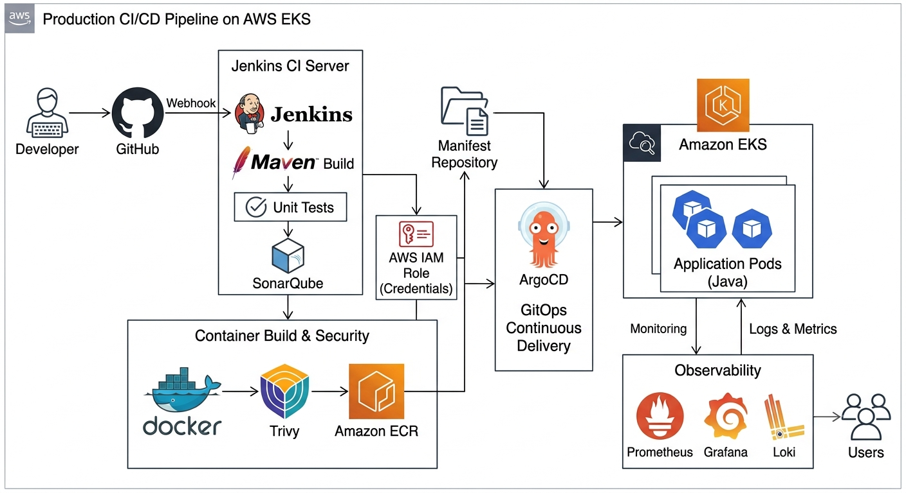

# 🚀 CI/CD Pipeline on AWS EKS


## Overview

This repository demonstrates a production-inspired end-to-end CI/CD pipeline for deploying a Java-based application onto an AWS EKS cluster using GitOps principles.

The pipeline automates application build, testing, code quality analysis, security scanning, containerization, image publishing, and Kubernetes deployment.

The objective of this project is to demonstrate how modern DevOps teams implement Continuous Integration and Continuous Deployment using industry-standard tools and best practices.

---

# Architecture



---

# Technology Stack

| Category | Technology |
|-----------|------------|
| Source Control | GitHub |
| CI | Jenkins |
| Build Tool | Maven |
| Code Quality | SonarQube |
| Security Scan | Trivy |
| Containerization | Docker |
| Container Registry | Amazon ECR |
| CD | ArgoCD |
| Orchestration | Kubernetes (Amazon EKS) |
| Infrastructure | Terraform |
| Monitoring | Prometheus, Grafana, Loki |

---

# CI/CD Pipeline Flow

The deployment workflow follows these stages:

1. Developer pushes code to GitHub.
2. GitHub webhook triggers Jenkins.
3. Jenkins checks out source code.
4. Maven builds the application.
5. Unit tests are executed.
6. SonarQube performs static code analysis.
7. Docker image is built.
8. Trivy scans the image for vulnerabilities.
9. Docker image is pushed to Amazon ECR.
10. Jenkins updates Kubernetes manifests.
11. ArgoCD detects Git changes.
12. ArgoCD deploys the application to Amazon EKS.

---

# Repository Structure

```
CICD-Pipeline/

├── architecture/
├── docs/
├── jenkins/
├── docker/
├── kubernetes/
├── argocd/
├── LICENSE
└── README.md
```

---

# Documentation

| Document | Description |
|-----------|-------------|
| implementation.md | Complete CI/CD implementation |
| deployment-flow.md | Pipeline execution stages |
| prerequisites.md | Environment requirements |
| security.md | Security best practices |

---

# Security

This project follows several DevSecOps practices including:

- Static code analysis using SonarQube
- Container image scanning using Trivy
- IAM least privilege
- GitOps deployment
- Kubernetes RBAC
- Secrets Management
- Separate Git repositories for source code and deployment manifests

---

# GitOps Workflow

Instead of deploying directly from Jenkins to Kubernetes, Jenkins updates the Kubernetes manifest repository.

ArgoCD continuously monitors the repository and synchronizes changes to the EKS cluster, ensuring version-controlled and auditable deployments.

---

# Future Improvements

- GitHub Actions implementation
- Helm charts
- Progressive delivery using Argo Rollouts
- OPA/Gatekeeper policy enforcement
- HashiCorp Vault integration
- Multi-environment deployments
- Automated rollback strategy

---

# License

This project is licensed under the MIT License.